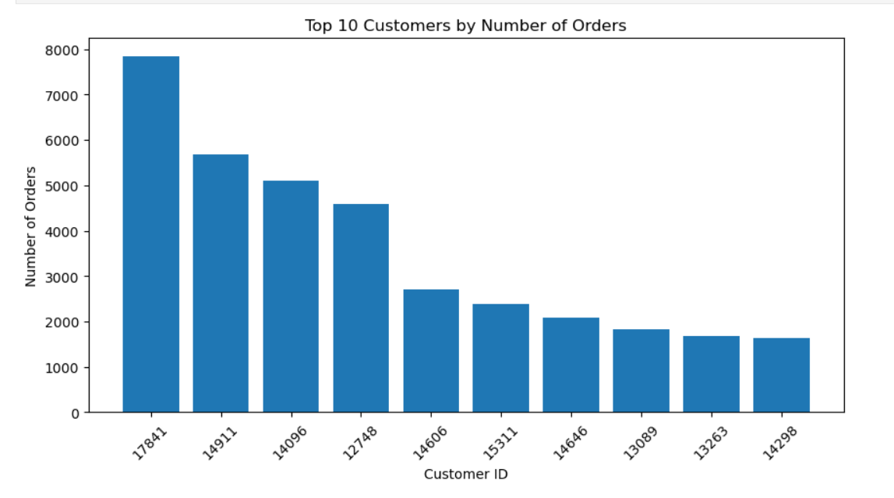
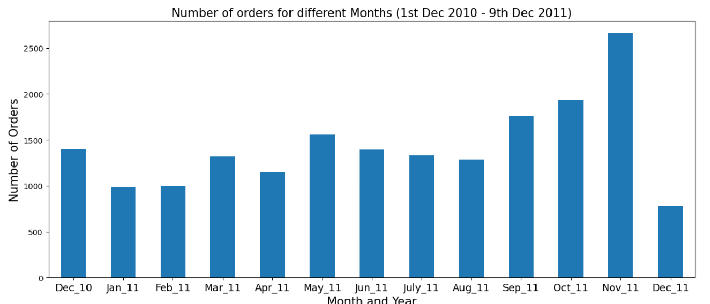
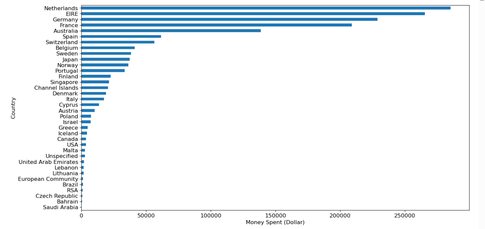

# 📊 Exploratory Data Analysis (EDA) Project

## 📌 Project Overview

Performed Exploratory Data Analysis (EDA) on e-commerce sales data using Python. The dataset was cleaned and processed to identify sales trends, customer behavior, and country-wise revenue patterns. Key insights were visualized using charts to support data-driven decision-making.

## 🎯 Objectives

* Clean and preprocess raw sales data
* Handle missing values effectively
* Perform trend and pattern analysis
* Generate business insights through visualization

## 🛠️ Tools & Technologies

* Python
* Pandas
* NumPy
* Matplotlib
* Seaborn
* Jupyter Notebook

## 📊 Key Analysis Performed

* Cleaned and processed raw datasets
* Handled missing values using appropriate techniques
* Performed trend analysis on sales data
* Visualized patterns using charts and graphs

## 📊 Key Visualizations

### Top Customers by Orders

### Orders by Month

### Revenue by Country

## 📈 Results & Insights

* Top customers contribute significantly to total orders, indicating customer concentration.
* Sales peak on **Thursdays**, showing higher mid-week activity.
* Strong growth observed in **October–November**, indicating seasonal demand.
* Majority of orders come from **European countries** like Germany, France, and EIRE.
* **Netherlands generates the highest revenue**, despite fewer orders, indicating high-value transactions.

## 📁 Project Structure

* **EDA_Project.ipynb** → Data analysis and visualization
* **README.md** → Project documentation

## 🚀 Future Improvements

* Add advanced visualizations
* Perform statistical analysis
* Build an interactive dashboard (Power BI/Tableau)

## 👩‍💻 Created By

**Dudekula Reshma**

